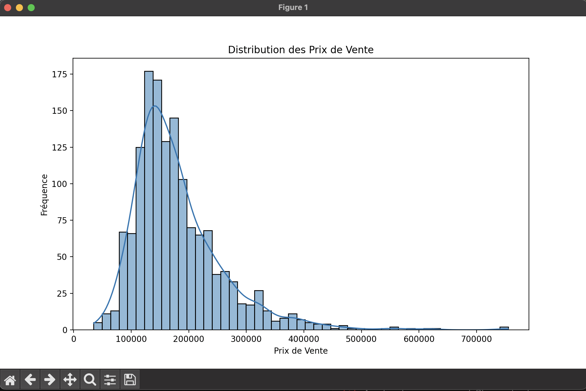
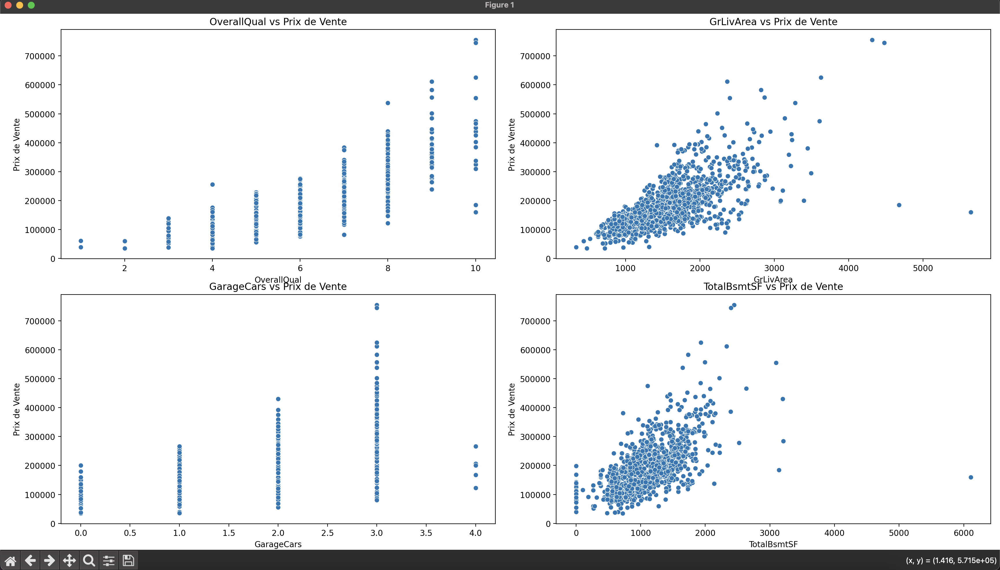
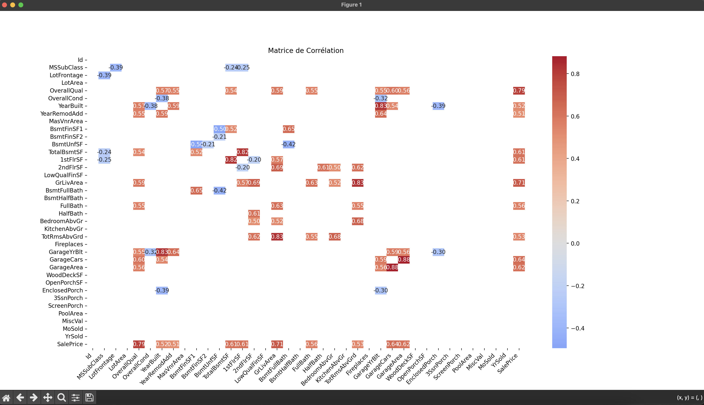

# House Price Prediction

Ce projet utilise des algorithmes de machine learning pour prédire les prix des maisons à partir d'un ensemble de données. Deux approches sont explorées : la régression linéaire et la régression avec random forest.

## Structure du Projet

- competition.py # Script utilisant la régression linéaire
- competitionV2.py # Script utilisant la régression avec des forêts aléatoires
- train.csv # Jeu de données d'entraînement
- test.csv # Jeu de données de test
- README.md # Ce fichier

## Pré-requis

Assurez-vous d'avoir installé les bibliothèques suivantes :

- pandas
- numpy
- matplotlib
- seaborn
- scikit-learn

Vous pouvez les installer en utilisant pip :

```bash
pip install pandas numpy matplotlib seaborn scikit-learn
```

## Utilisation

### Régression Linéaire

Le script competition.py utilise la régression linéaire pour prédire les prix des maisons.

#### Étapes :

- Chargement des données d'entraînement et de test.
- Exploration des données: informations sur les datasets.
- Visualisation des données: histogramme de la distribution des prix de vente et matrice de corrélation.
- Préparation des données pour le machine learning: traitement des valeurs manquantes, encodage des variables catégorielles.
- Entraînement du modèle de régression linéaire.
- Évaluation du modèle sur un ensemble de validation.
- Prédiction sur les données de test.
- Sauvegarde des prédictions dans un fichier submission.csv.

#### Pour exécuter le script :

```python
python3 competition.py
```

### Régression avec Random Forest

Le script competitionV2.py utilise la régression avec random forest pour prédire les prix des maisons.

#### Étapes :

- Chargement des données d'entraînement et de test.
- Préparation des données pour le machine learning: traitement des valeurs manquantes, encodage des variables catégorielles.
- Entraînement du modèle de régression avec random forest.
- Évaluation du modèle sur un ensemble de validation.
- Prédiction sur les données de test.
- Sauvegarde des prédictions dans un fichier submission.csv.

#### Pour exécuter le script :

```python
python3 competitionV2.py
```

## Visualisations

### Distribution des Prix de Vente

Histogramme pour visualiser la distribution des prix de vente :


Scatter plot pour voir l'évolution des prix sur 4 features :



### Matrice de Corrélation

Le script génère une heatmap pour visualiser les corrélations entre les différentes caractéristiques numériques :


## Contribuer

<<<<<<< HEAD
Les contributions sont les bienvenues ! N'hésitez pas à ouvrir une issue ou à soumettre une pull request.
=======
Les contributions sont les bienvenues ! N'hésitez pas à ouvrir une issue ou à soumettre une pull request.
>>>>>>> main
